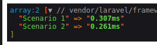
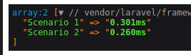

# Benchmarking

A ideia é trazer a diferença entre requests com [Full-text search indexes](https://www.mongodb.com/basics/full-text-search#:~:text=Full%2Dtext%20search%20involves%20reviewing,PDFs%2C%20and%20more.)
e buscas em um JSON com os próprios métodos do PHP.

Alguns pontos devem ser considerados:

1. O Laravel tem built-in o  [scout](https://laravel.com/docs/11.x/scout), que é uma solução para
implementar full-text search de forma simples, utilizando serviços como [Algolia](https://www.algolia.com/pt-br/?utm_source=google&utm_medium=paid_search&utm_campaign=rl_amer_search_brand&utm_content=algolia&utm_term=algolia&utm_region=amer&utm_model=brand&utm_ag=rl&_bt=607885590646&_bm=e&_bn=g&gad_source=1&gclid=CjwKCAjwwr6wBhBcEiwAfMEQs-UHDh2YeaaWigDssl1iUOoFLlQkW3itwriUTHtKNyiH8uRqlctV3BoCuiIQAvD_BwE)
, [Meilisearch](https://www.meilisearch.com/) e [TypeSense](https://typesense.org/docs/guide/install-typesense.html#option-2-local-machine-self-hosting).
Por serem serviços, alguns são pagos e outros Open Source. 
2. Esse Benchmarking não metrifica quanto de RAM ou CPU está sendo gasto.
3. O processo de marshalling e unmarshalling é considerado "caro", 
por isso deve ser feito com cautela. O processo em busca no JSON pode causar problemas de memória,
mas não consigo metrificar isso nessa POC. [leia mais](https://www.baeldung.com/cs/serialization-deserialization)

### Dito isso, vamos aos testes:

**Foram criados 2 endpoints**

**/seeding** -> Fará a introspecção de dados do JSON no database.

**/find-json** -> Fará as buscas do dado desejado, pelo input mockado no código.

#### Considerando o JSON test-file.json que está na pasta public, criei 2 cenários:

1. Busca os valores utilizando o Full-text search index.
2. Busca os valores diretamente do JSON.

#### A média dos resultados de 10.000 iterações para uma palavra que NÃO existia foi respectivamente:

####  A média dos resultados de 10.000 iterações para uma palavra que existia foi respectivamente

### Conclusão
Ambas as repostas são extremamente rápidas, sendo a busca em JSON mais veloz em todos os casos, porém, não está sendo considerado o
uso de RAM e CPU para conversão de dados, o que em grande escala pode ser trabalhoso. Outro ponto não explicíto, é a coesão dos dados da resposta,
que com a busca indexada apresenta melhor experiência de busca, sendo talvez mais ideal para a experiência do usuário.

Bancos de dados relacionais costumam utilizar [AVL Tree](https://www.educative.io/answers/how-to-optimize-the-database-indexing-using-avl-trees) para balancear 
e distribuir indexes, sendo trabalhoso redistribui-los a cada nova inserção. Nossa vantagem é: Nos faremos poucas mutações e muitas consultas, ou seja,
extrair o melhor do poder de indexação.

Então, qual abordagem devemos seguir ?
- Na minha pesquisa, ambas as abordagens resolvem o problema, sendo a pesquisa em JSON simplista e a inserção em banco mais trabalhosa, podendo ser
esse o criétio de escolha.

Existem outras opções de serviço que serão abordadas fora desse repositório, então por hora é isso.  **Fim :)**
